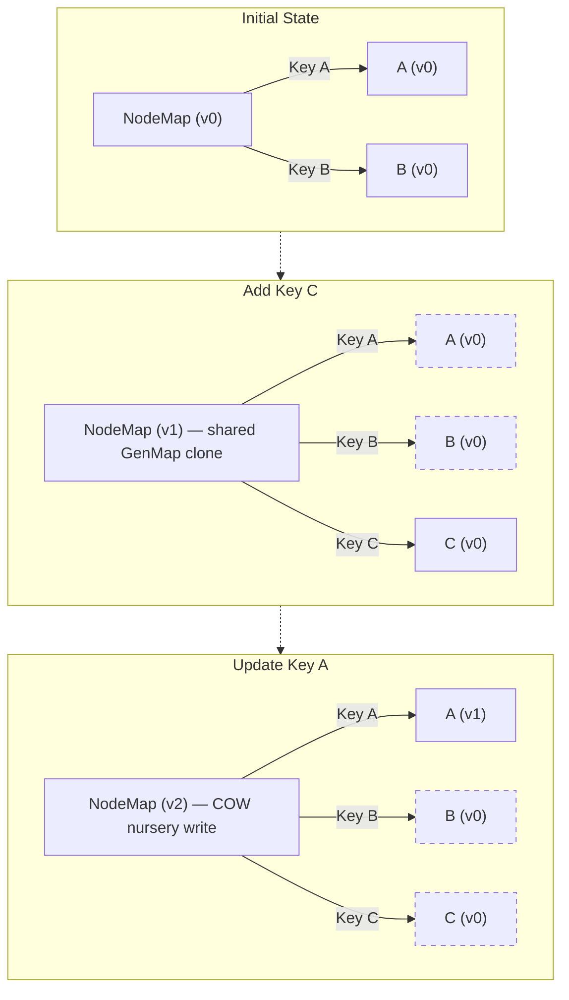

# Lexical Architecture Reference

A deep-dive reference covering Lexical's core architecture, init flow, reconciliation, selection, commands, beforeinput handling, plugin system, toolbar integration, and supporting subsystems.

---

## Table of Contents

1. [Architecture Overview](#1-architecture-overview)
2. [Editor Initialization](#2-editor-initialization)
3. [MutationObserver & WeakMaps](#3-mutationobserver--weakmaps)
4. [Updates & Synchronous Behavior](#4-updates--synchronous-behavior)
5. [$beginUpdate](#5-beginupdate)
6. [$commitPendingUpdates](#6-commitpendingupdates)
7. [Reconciliation](#7-reconciliation)
8. [Dirty Tracking & subTreeTextContent](#8-dirty-tracking--subtreetextcontent)
9. [Leaf Nodes](#9-leaf-nodes)
10. [Immutability & getWritable](#10-immutability--getwritable)
11. [Selection](#11-selection)
12. [Commands](#12-commands)
13. [beforeinput Event](#13-beforeinput-event)
14. [Plugin Registration](#14-plugin-registration)
15. [Toolbar Integration & hasFormat](#15-toolbar-integration--hasformat)

---

## 1. Architecture Overview

Lexical is built around three layers:

```
┌────────────────────────────────────────────────┐
│  EditorState  (immutable, frozen after commit) │  ← the truth
│   NodeMap: Map<NodeKey, LexicalNode>           │
│   Selection: RangeSelection | NodeSelection    │
└──────────────────────┬─────────────────────────┘
                       │  reconciler diffs these two
┌──────────────────────▼─────────────────────────┐
│  DOM  (the contenteditable div)                 │  ← the view
│   keyToDOMMap: Map<NodeKey, HTMLElement>        │
└────────────────────────────────────────────────┘
                       ▲
┌──────────────────────┴─────────────────────────┐
│  Events  (browser → Lexical commands)           │  ← the input
│   MutationObserver + DOM events                 │
└────────────────────────────────────────────────┘
```

### The Node Tree

The editor state holds a **flat `Map<string, LexicalNode>`**, not a nested object tree. Nodes reference each other by key strings. The hierarchy is encoded as a **doubly-linked list** inside each `ElementNode`:

```ts
// Inside every LexicalNode:
__key: string      // unique runtime identifier, e.g. "4"
__parent: string | null
__next: string | null   // sibling pointers
__prev: string | null

// Inside every ElementNode additionally:
__first: string | null  // first child key
__last: string | null   // last child key
__size: number          // child count
```

A document like:
```
Root
 └─ Paragraph ("1")
     ├─ TextNode  ("2")  "Hello"
     └─ TextNode  ("3")  " world"
```

Is stored as:
```ts
nodeMap = new Map([
  ['root', RootNode { __first: '1', __last: '1', __size: 1 }],
  ['1',    ParagraphNode { __first: '2', __last: '3', __size: 2,
                           __parent: 'root', __next: null, __prev: null }],
  ['2',    TextNode { __text: 'Hello', __parent: '1', __next: '3', __prev: null }],
  ['3',    TextNode { __text: ' world', __parent: '1', __next: null, __prev: '2' }],
])
```

### Node Class Hierarchy

```
LexicalNode          (base: key, parent, siblings)
 ├─ TextNode         (text content, format bitmask, style string)
 ├─ LineBreakNode    (renders as <br>)
 ├─ TabNode          (renders as <span data-lexical-text>\t</span>)
 └─ ElementNode      (block/container: first/last/size)
     ├─ RootNode     (always key='root', maps to the contenteditable div)
     ├─ ParagraphNode (→ <p>)
     ├─ HeadingNode  (→ <h1>...<h6>)
     ├─ QuoteNode    (→ <blockquote>)
     ├─ ListNode     (→ <ul>/<ol>)
     ├─ ListItemNode (→ <li>)
     └─ DecoratorNode (renders React/custom UI, contentEditable=false)
```

Every node class must implement:
```ts
static getType(): string   // 'paragraph', 'text', etc.
static clone(node: T): T   // shallow copy for copy-on-write
createDOM(config): HTMLElement    // initial DOM creation
updateDOM(prev, dom, config): boolean  // true = recreate DOM, false = mutate in place
```

### Key Files

| File | Purpose |
|---|---|
| `LexicalEditor.ts` | `createEditor()`, `LexicalEditor` class, register methods |
| `LexicalEditorState.ts` | `EditorState` class, clone/read/toJSON |
| `LexicalUpdates.ts` | `$beginUpdate`, `$commitPendingUpdates`, transform loop |
| `LexicalReconciler.ts` | DOM diffing, `$createNode`, managed `<br>` logic |
| `LexicalNode.ts` | Base `LexicalNode`, `getWritable()`, copy-on-write |
| `LexicalElementNode.ts` | `ElementNode`, `ElementDOMSlot`, managed line break |
| `LexicalTextNode.ts` | `TextNode`, format bitmask, `createDOM`/`updateDOM` |
| `LexicalParagraphNode.ts` | `ParagraphNode` → `<p>` |
| `LexicalLineBreakNode.ts` | `LineBreakNode` → `<br>` |
| `LexicalEvents.ts` | Browser events → commands wiring |
| `LexicalSelection.ts` | `RangeSelection`, `NodeSelection`, selection logic |
| `LexicalMutations.ts` | MutationObserver flush logic |

### How `<br>` Is Rendered in an Empty `<p>`

In the live editor DOM, Lexical inserts a **"managed" `<br>`** that is NOT part of the EditorState. The logic:

```ts
// LexicalReconciler.ts
type LastChildState = 'line-break' | 'decorator' | 'empty';

function isLastChildLineBreakOrDecorator(element, nodeMap): null | LastChildState {
  if (element) {
    const lastKey = element.__last;
    if (lastKey) {
      const node = nodeMap.get(lastKey);
      if (node) {
        return $isLineBreakNode(node) ? 'line-break'
             : ($isDecoratorNode(node) && node.isInline()) ? 'decorator'
             : null;
      }
    }
    return 'empty'; // __last is null → no children
  }
  return null;
}

function reconcileElementTerminatingLineBreak(prevElement, nextElement, dom) {
  const prevLineBreak = isLastChildLineBreakOrDecorator(prevElement, activePrevNodeMap);
  const nextLineBreak = isLastChildLineBreakOrDecorator(nextElement, activeNextNodeMap);
  if (prevLineBreak !== nextLineBreak) {
    nextElement.getDOMSlot(dom).setManagedLineBreak(nextLineBreak);
  }
}
```

`setManagedLineBreak`:
```ts
insertManagedLineBreak(webkitHack: boolean): void {
  const br = document.createElement('br');
  element.insertBefore(br, before);
  element.__lexicalLineBreak = br; // stored on the DOM node directly
}
```

Result: An empty `<p>` looks like:
```html
<p data-lexical-editor="...">
  <br>   <!-- managed by Lexical, NOT in EditorState -->
</p>
```

| Scenario | `lastChildState` | DOM result |
|---|---|---|
| Empty paragraph | `'empty'` | `<p><br></p>` |
| Paragraph ends with `LineBreakNode` | `'line-break'` | `<p>...<br><br></p>` |
| Paragraph ends with inline `DecoratorNode` (WebKit) | `'decorator'` | `<p>...<br></p>` |
| Paragraph ends with text | `null` → remove br | `<p>Hello</p>` |

For HTML export (copy-paste), `ParagraphNode.exportDOM` separately handles empties:
```ts
exportDOM(editor: LexicalEditor): DOMExportOutput {
  const {element} = super.exportDOM(editor);
  if (isHTMLElement(element)) {
    if (this.isEmpty()) {
      element.append(document.createElement('br'));
    }
  }
  return {element};
}
```

### How Text Renders

```ts
// TextNode.createDOM (simplified)
createDOM(config: EditorConfig): HTMLElement {
  const format = this.__format;
  let element: HTMLElement;

  const outerTag = getElementOuterTag(this, format); // 'code' | 'mark' | 'sub' | 'sup' | null
  const innerTag = getElementInnerTag(this, format); // 'strong' | 'em' | 'u' | 's' | null

  if (outerTag !== null) {
    element = document.createElement(outerTag);
    if (innerTag !== null) {
      const inner = document.createElement(innerTag);
      element.appendChild(inner);
    }
  } else if (innerTag !== null) {
    element = document.createElement(innerTag);
  } else {
    element = document.createElement('span');
  }

  if (this.__style) {
    element.style.cssText = this.__style;
  }
  setTextContent(this.__text, element, this);
  return element;
}
```

Output for `"Hello"` with bold+italic:
```html
<strong><em data-lexical-text="true">Hello</em></strong>
```

`data-lexical-text="true"` tells the MutationObserver this span is Lexical-owned text.

---

## 2. Editor Initialization

Init has two phases. In React you get them from `LexicalComposer` + `LexicalContentEditable`; in vanilla JS:

```ts
const editor = createEditor(config);   // Phase 1
editor.setRootElement(div);            // Phase 2
```

### Phase 1 — `createEditor(config)`

```
createEditor(config)
 │
 ├─ 1. createEmptyEditorState()
 │      → new EditorState(new Map([['root', new RootNode()]]))
 │
 ├─ 2. Build registeredNodes: Map<string, RegisteredNode>
 │      Built-ins: [RootNode, TextNode, LineBreakNode, TabNode,
 │                  ParagraphNode, ArtificialNode, ...config.nodes]
 │      For each klass:
 │        registeredNodes.set(klass.getType(), {
 │          klass, transforms, replace, replaceWithKlass,
 │          sharedNodeState, exportDOM
 │        })
 │
 ├─ 3. initializeConversionCache(registeredNodes, html?.import)
 │      Calls klass.importDOM() on every node class
 │      Builds: Map<tagName, Array<conversionFn>>
 │
 ├─ 4. new LexicalEditor(...)
 │      _rootElement = null
 │      _editorState = emptyEditorState
 │      _pendingEditorState = null
 │      _keyToDOMMap = new Map()
 │      _updates = []
 │      _updating = false
 │      _listeners = { update, decorator, mutation, root, textcontent, editable }
 │      _commands = new Map()
 │      _dirtyType = NO_DIRTY_NODES (0)
 │      _cloneNotNeeded = new Set()
 │      _dirtyLeaves = new Set()
 │      _dirtyElements = new Map()
 │      _key = createUID()
 │
 ├─ 5. if config.editorState provided:
 │        editor._pendingEditorState = initialEditorState
 │        editor._dirtyType = FULL_RECONCILE
 │
 └─ 6. registerDefaultCommandHandlers(editor)
        Registers 5 commands at COMMAND_PRIORITY_EDITOR:
          BEFORE_INPUT_COMMAND → $handleBeforeInput
          INPUT_COMMAND        → $handleInput
          COMPOSITION_START_COMMAND → $handleCompositionStart
          COMPOSITION_END_COMMAND   → $handleCompositionEnd
          KEY_DOWN_COMMAND     → $handleKeyDown
```

### Phase 2 — `editor.setRootElement(div)`

```
setRootElement(nextRootElement)
 │
 ├─ 1. prevRootElement = this._rootElement
 ├─ 2. pendingEditorState = _pendingEditorState || _editorState
 ├─ 3. this._rootElement = nextRootElement
 │
 ├─ 4. resetEditor(editor, null, nextRootElement, pendingEditorState)
 │        _keyToDOMMap.clear()
 │        _editorState = createEmptyEditorState()
 │        _pendingEditorState = pendingEditorState
 │        Clear all dirty sets
 │        Disconnect any existing MutationObserver
 │        _keyToDOMMap.set('root', nextRootElement) ← root → DOM
 │
 ├─ 5. Apply CSS to contenteditable:
 │        style.userSelect = 'text'
 │        style.whiteSpace = 'pre-wrap'
 │        style.wordBreak = 'break-word'
 │        setAttribute('data-lexical-editor', 'true')
 │
 ├─ 6. this._window = getDefaultView(nextRootElement)
 ├─ 7. this._dirtyType = FULL_RECONCILE
 │
 ├─ 8. initMutationObserver(this)
 │        window.addEventListener('textInput', updateTimeStamp, true)
 │        editor._observer = new MutationObserver(callback)
 │        (NOT yet observe()d)
 │
 ├─ 9. this._updateTags.add(HISTORY_MERGE_TAG)
 │
 ├─ 10. $commitPendingUpdates(this)   ← FIRST RENDER
 │
 ├─ 11. addRootElementEvents(nextRootElement, editor)
 │         rootElement.__lexicalEditor = editor
 │         document.addEventListener('selectionchange', onDocumentSelectionChange)
 │         Registers: keydown, pointerdown, compositionstart, compositionend,
 │                    input, click, cut, copy, paste, dragstart, dragover,
 │                    dragend, focus, blur, drop, beforeinput (if supported)
 │
 ├─ 12. Add theme.root CSS class to nextRootElement
 └─ 13. triggerListeners('root', editor, false, nextRootElement, null)
```

### First Render Trace (default empty editor)

```
pendingEditorState._nodeMap = {
  'root': RootNode { __first: '1', __last: '1', __size: 1 },
  '1':    ParagraphNode { __parent: 'root', __first: null, __last: null, __size: 0 }
}

$reconcileRoot(emptyPrevState, pendingState, editor, FULL_RECONCILE, ...)
  │  treatAllNodesAsDirty = true
  │
  ├─ observer.disconnect()
  │
  ├─ $reconcileNode('root', null)
  │    dom = the actual <div contenteditable>
  │    $reconcileChildren:
  │      prevChildren = []
  │      nextChildren = ['1']
  │      → $createChildren(['1'], ...)
  │           $createNode('1'):
  │             dom = document.createElement('p')
  │             p.classList.add(theme.paragraph)
  │             _keyToDOMMap.set('1', p)
  │             reconcileElementTerminatingLineBreak(null, paragraphNode, p):
  │               nextLineBreak = 'empty'
  │               → setManagedLineBreak('empty')
  │                 → p.insertBefore(br, null)
  │                 → p.__lexicalLineBreak = br
  │             div.insertBefore(p, null)
  │
  ├─ observer.observe(rootElement, {characterData:true, childList:true, subtree:true})
  └─ triggerListeners('update', ...)
```

Final DOM:
```html
<div contenteditable="true" data-lexical-editor="true" class="<theme.root>">
  <p class="<theme.paragraph>">
    <br>
  </p>
</div>
```

### React Wiring

```tsx
// LexicalComposer
const editor = createEditor(config);
return <LexicalEditorContext.Provider value={[editor, {getTheme}]}>
  {children}
</LexicalEditorContext.Provider>

// LexicalContentEditable
function LexicalContentEditable({ ref }) {
  const [editor] = useLexicalComposerContext();
  useEffect(() => {
    editor.setRootElement(ref.current);
    return () => editor.setRootElement(null);
  }, [editor]);
  return <div ref={ref} contentEditable />;
}
```

---

## 3. MutationObserver & WeakMaps

### Why the MutationObserver?

The browser can change `contenteditable` DOM without asking Lexical: spell-check, autocorrect, IME composition, Android keyboard, browser extensions (Grammarly, 1Password), default `contenteditable` behavior. Without the observer, any of these would silently corrupt the editor.

```ts
// LexicalMutations.ts (simplified)
function flushMutations(editor, mutations, observer) {
  updateEditorSync(editor, () => {
    for (const mutation of mutations) {
      if (mutation.type === 'characterData') {
        // Text content changed (spell-check, etc.)
        if (shouldFlushTextMutations) {
          $handleTextMutation(targetDOM, targetNode, editor);
        }

      } else if (mutation.type === 'childList') {
        // Structural change
        for (const addedDOM of mutation.addedNodes) {
          const isKnown = $getNodeFromDOMNode(addedDOM) !== null;
          const isManagedBR = isManagedLineBreak(addedDOM, parentDOM, editor);
          if (!isKnown && !isManagedBR) {
            parentDOM.removeChild(addedDOM); // revert
          }
        }
        for (const removedDOM of mutation.removedNodes) {
          if (isManagedLineBreak(removedDOM, targetDOM, editor)) {
            targetDOM.appendChild(removedDOM); // restore
          }
        }
        badDOMTargets.set(nodeDOM, targetNode);
      }
    }

    for (const [nodeDOM, targetNode] of badDOMTargets) {
      targetNode.reconcileObservedMutation(nodeDOM, editor);
    }
  });
}
```

### The Timing Contract

```
reconciler wants to write:
  observer.disconnect()
  → mutate DOM freely
  observer.observe()
  observer.takeRecords()   ← drain mutations caused by reconciler itself

browser or extension writes:
  observer callback fires
  → flushMutations() syncs (text) or reverts (structure)
```

`TEXT_MUTATION_VARIANCE = 100ms` is for Android: if a `characterData` mutation arrives within 100ms of the last `textInput` event, Lexical defers handling it to avoid fighting the IME.

### WeakMaps in Core

Four uses, each solving a different memory-leak problem:

#### 1. `cachedNodeMaps: WeakMap<EditorState, TypeToNodeMap>`

```ts
// LexicalUtils.ts:1904
const cachedNodeMaps = new WeakMap<EditorState, TypeToNodeMap>();

export function getCachedTypeToNodeMap(editorState: EditorState): TypeToNodeMap {
  let typeToNodeMap = cachedNodeMaps.get(editorState);
  if (!typeToNodeMap) {
    typeToNodeMap = computeTypeToNodeMap(editorState);
    cachedNodeMaps.set(editorState, typeToNodeMap);
  }
  return typeToNodeMap;
}
```

Every `editor.update()` creates a new `EditorState`. Regular `Map` would accumulate cached indexes forever.

#### 2. `rootElementToDocument: WeakMap<HTMLElement, Document>`

```ts
// LexicalEvents.ts:192
const rootElementToDocument = new WeakMap<HTMLElement, Document>();
```

Portal support — `createPortal` can render into a different document. Need to remove `selectionchange` from the correct one.

#### 3. `rootElementsRegistered: WeakMap<Document, number>`

```ts
const rootElementsRegistered = new WeakMap<Document, number>();

const count = rootElementsRegistered.get(doc) ?? 0;
if (count < 1) {
  doc.addEventListener('selectionchange', onDocumentSelectionChange);
}
rootElementsRegistered.set(doc, count + 1);
```

Ref-count for the shared `selectionchange` listener.

#### 4. `preParentCache: WeakMap<Node, null | Node>`

```ts
// LexicalTextNode.ts:1206
const preParentCache = new WeakMap<Node, null | Node>();

export function findParentPreDOMNode(node: Node) {
  let cached;
  let parent = node.parentNode;
  const visited = [node];

  while (parent !== null && (cached = preParentCache.get(parent)) === undefined && !isNodePre(parent)) {
    visited.push(parent);
    parent = parent.parentNode;
  }

  const resultNode = cached === undefined ? parent : cached;
  for (let i = 0; i < visited.length; i++) {
    preParentCache.set(visited[i], resultNode);
  }
  return resultNode;
}
```

DOM traversal memoization for HTML paste. Keys are transient pasted DOM nodes.

### DOM Expando Properties (not WeakMaps)

```ts
// LexicalUtils.ts:540
export function setNodeKeyOnDOMNode(dom: Node, editor: LexicalEditor, key: NodeKey) {
  const prop = `__lexicalKey_${editor._key}`;
  (dom as any)[prop] = key;
}
```

Other expandos: `dom.__lexicalEditor`, `dom.__lexicalLineBreak`, `dom.__lexicalTextContent`. Used for performance — direct property lookup is faster than WeakMap.get on every keystroke.

### Summary Table

| Usage | Key type | Why WeakMap not Map |
|---|---|---|
| `cachedNodeMaps` | `EditorState` | States created every update |
| `rootElementToDocument` | `HTMLElement` | Root elements can be removed |
| `rootElementsRegistered` | `Document` | iframes can be destroyed |
| `preParentCache` | `Node` | Temporary paste DOM nodes |

---

## 4. Updates & Synchronous Behavior

`editor.update()` is **asynchronous by default**. Mutations run immediately inside the callback, but commit (reconciliation + listeners) is deferred to a microtask. Multiple calls in one JS tick are batched into one commit.

### Default Path — Microtask Deferred

```ts
// LexicalUtils.ts:140
export const scheduleMicroTask: (fn: () => void) => void =
  typeof queueMicrotask === 'function'
    ? queueMicrotask
    : (fn) => Promise.resolve().then(fn);
```

```ts
// end of $beginUpdate
if (shouldUpdate) {
  if (pendingEditorState._flushSync) {
    pendingEditorState._flushSync = false;
    $commitPendingUpdates(editor);             // synchronous
  } else if (editorStateWasCloned) {
    scheduleMicroTask(() => {
      $commitPendingUpdates(editor);           // microtask (default)
    });
  }
}
```

### Batching

```ts
editor.update(() => { node.setTextContent('Hello'); });
editor.update(() => { node2.setTextContent('World'); });
editor.update(() => { node3.remove(); });
// Only ONE $commitPendingUpdates fires in the next microtask
```

```ts
export function updateEditor(editor, updateFn, options) {
  if (editor._updating) {
    editor._updates.push([updateFn, options]); // queue
  } else {
    $beginUpdate(editor, updateFn, options);
  }
}
```

### Three Nesting Scenarios

**A. Called from outside any update (idle):**
```ts
editor.update(() => {});   // $beginUpdate runs, clones state, schedules microtask
editor.update(() => {});   // $beginUpdate runs, reuses pending state
// → one microtask commit handles both
```

**B. Called from inside an update callback:**
```ts
editor.update(() => {
  node.setTextContent('outer');
  editor.update(() => {           // _updating is true → pushed to _updates
    node2.setTextContent('inner');
  });
});
// $processNestedUpdates drains the queue before transforms run
```

**C. Called from a listener (post-commit):**
```ts
editor.registerUpdateListener(() => {
  editor.update(() => { /* fn C */ });  // queued, drained by $triggerEnqueuedUpdates
});
```

### `discrete: true` — Force Synchronous

```ts
editor.update(() => {
  node.setTextContent('immediate');
}, { discrete: true });
// $commitPendingUpdates runs synchronously, before this line returns
```

Sets `pendingEditorState._flushSync = true`. Used by `editor.focus()`, tests, and code that must measure the updated DOM immediately.

### `updateEditorSync` — Internal Synchronous API

```ts
export function updateEditorSync(editor, updateFn, options) {
  if (activeEditor === editor && options === undefined) {
    updateFn(); // already in context, run inline
  } else {
    $beginUpdate(editor, updateFn, options);
  }
}
```

Used by command dispatch and `editor.focus()`. When already inside an update for the same editor, runs the function body inline — no new cycle, no clone, no scheduling.

### Composition (IME) Forced Sync

```ts
// LexicalUpdates.ts:976
if (startingCompositionKey !== endingCompositionKey) {
  pendingEditorState._flushSync = true;
}
```

| Path | When | DOM commit |
|---|---|---|
| `editor.update(fn)` (default) | Any time | Next microtask, batched |
| `editor.update(fn, { discrete: true })` | Need immediate DOM | Sync, before return |
| `updateEditorSync(editor, fn)` | Already in update context | Inline — no new cycle |
| `editor.dispatchCommand(cmd, p)` | Anywhere | Inline if in update, new sync cycle if not |
| IME composition change | Auto-detected | Forced sync via `_flushSync` |
| Listener calling `editor.update()` | Post-commit | New cycle, via `$triggerEnqueuedUpdates` |

---

## 5. $beginUpdate

`$beginUpdate` is the **single internal implementation of "start an update cycle"**. `updateEditor` is the re-entrancy guard that either calls `$beginUpdate` or queues work.

```ts
// The public path — re-entrancy guard
export function updateEditor(editor, updateFn, options) {
  if (editor._updating) {
    editor._updates.push([updateFn, options]); // queue it
  } else {
    $beginUpdate(editor, updateFn, options);   // start it
  }
}
```

### Four Callers of `$beginUpdate`

1. **`updateEditor`** — public API path. Guard needed.
2. **`updateEditorSync`** — command dispatch + focus. Guard not needed when already in context.
3. **`$triggerEnqueuedUpdates`** — post-commit queue drain. Starts fresh cycle.
4. **`$processNestedUpdates`** — within-cycle drain. `$beginUpdate` only when no pending state.

### Full Body

```ts
function $beginUpdate(editor, updateFn, options) {
  // ── SETUP ──
  addTags(editor, options?.tag);
  if (options?.onUpdate) editor._deferred.push(options.onUpdate);

  if (pendingEditorState === null || pendingEditorState._readOnly) {
    pendingEditorState = cloneEditorState(currentEditorState);
    editorStateWasCloned = true;
  }
  pendingEditorState._flushSync = options?.discrete ?? false;

  activeEditorState = pendingEditorState;
  isReadOnlyMode = false;
  activeEditor = editor;
  editor._updating = true;

  // ── MUTATION PHASE ──
  try {
    pendingEditorState._selection = $internalCreateSelection(editor, event);

    updateFn();                          // user mutations

    $processNestedUpdates(editor);       // drain queued nested updates
    applySelectionTransforms(pendingEditorState, editor);

    if (editor._dirtyType !== NO_DIRTY_NODES) {
      $applyAllTransforms(pendingEditorState, editor);
      $processNestedUpdates(editor);
      $garbageCollectDetachedNodes(...);
    }
  } catch (error) {
    editor._pendingEditorState = currentEditorState;
    editor._dirtyType = FULL_RECONCILE;
    $commitPendingUpdates(editor);
    return;
  } finally {
    activeEditorState = previousActiveEditorState;
    isReadOnlyMode = previousReadOnlyMode;
    activeEditor = previousActiveEditor;
    editor._updating = previouslyUpdating;
  }

  // ── COMMIT DECISION ──
  if (shouldUpdate) {
    if (pendingEditorState._flushSync) {
      $commitPendingUpdates(editor);
    } else if (editorStateWasCloned) {
      scheduleMicroTask(() => $commitPendingUpdates(editor));
    }
  } else {
    editor._pendingEditorState = null;
  }
}
```

### Why Separation Matters

- **`try/finally` context teardown** — `activeEditorState`, `activeEditor`, `isReadOnlyMode` must be restored even on throw
- **Transforms run after ALL mutations are batched** — `$applyAllTransforms` runs after `$processNestedUpdates`, so transforms see the complete merged state
- **`editorStateWasCloned` controls microtask scheduling** — only the call that cloned schedules the microtask

If `updateEditor` did everything itself, `updateEditorSync` and `$triggerEnqueuedUpdates` couldn't call it (the guard would prevent execution when `_updating` is true).

---

## 6. $commitPendingUpdates

The **commit phase** — point of no return where pending `EditorState` becomes real.

### Nine Stages

```
$commitPendingUpdates(editor)
  │
  ├─ 0. Guard: nothing pending? return early
  ├─ 1. Swap the active EditorState
  ├─ 2. DOM reconciliation (skip if headless)
  ├─ 3. Freeze the committed state
  ├─ 4. Reset dirty-tracking sets
  ├─ 5. GC detached decorators
  ├─ 6. Sync DOM selection + block cursor
  ├─ 7. Fire mutation listeners
  ├─ 8. Fire other listeners (update, textcontent, decorator)
  └─ 9. Drain queued work
```

### Stage 1 — State Swap (Before Reconciliation)

```ts
const currentEditorState = editor._editorState;  // save "before"
editor._pendingEditorState = null;
editor._editorState = pendingEditorState;         // SWAP
```

This happens **before** reconciliation. Code running during reconciliation sees the new state via `editor.getEditorState()`.

### Stage 2 — DOM Reconciliation

```ts
if (!shouldSkipDOM && needsUpdate && observer !== null) {
  activeEditor = editor;
  activeEditorState = pendingEditorState;
  isReadOnlyMode = false;
  editor._updating = true;
  try {
    observer.disconnect();

    mutatedNodes = $reconcileRoot(
      currentEditorState, pendingEditorState, editor,
      dirtyType, dirtyElements, dirtyLeaves,
    );
  } catch (error) {
    editor._onError(error);
    if (!isAttemptingToRecoverFromReconcilerError) {
      resetEditor(editor, null, rootElement, pendingEditorState);
      initMutationObserver(editor);
      editor._dirtyType = FULL_RECONCILE;
      isAttemptingToRecoverFromReconcilerError = true;
      $commitPendingUpdates(editor, currentEditorState);
      isAttemptingToRecoverFromReconcilerError = false;
    } else {
      throw error;
    }
    return;
  } finally {
    observer.observe(rootElement, observerOptions);
  }
}
```

### Stage 3 — Freeze

```ts
if (!pendingEditorState._readOnly) {
  pendingEditorState._readOnly = true;
  if (__DEV__) {
    handleDEVOnlyPendingUpdateGuarantees(pendingEditorState);
    Object.freeze(pendingSelection.anchor);
    Object.freeze(pendingSelection.focus);
    Object.freeze(pendingSelection);
  }
}
```

### Stages 4-9

```ts
// Stage 4 — Reset dirty tracking
editor._dirtyType = NO_DIRTY_NODES;
editor._cloneNotNeeded.clear();
editor._dirtyLeaves = new Set();
editor._dirtyElements = new Map();
editor._normalizedNodes = new Set();
editor._updateTags = new Set();

// Stage 5
$garbageCollectDetachedDecorators(editor, pendingEditorState);

// Stage 6 — Selection
if (editor._editable && domSelection !== null && /* selection changed */) {
  observer.disconnect();
  updateDOMSelection(currentSelection, pendingSelection, editor, domSelection, tags, rootElement, nodeCount);
  updateDOMBlockCursorElement(editor, rootElement, pendingSelection);
  observer.observe(rootElement, observerOptions);
}

// Stage 7 — Mutation listeners
if (mutatedNodes !== null) {
  triggerMutationListeners(editor, mutatedNodes, tags, dirtyLeaves, currentEditorState);
}

// Stage 8 — Other listeners
if (pendingDecorators !== null) {
  editor._decorators = pendingDecorators;
  triggerListeners('decorator', editor, true, pendingDecorators);
}
triggerTextContentListeners(editor, recoveryEditorState || currentEditorState, pendingEditorState);
triggerListeners('update', editor, true, {
  dirtyElements, dirtyLeaves,
  editorState: pendingEditorState,
  mutatedNodes, normalizedNodes,
  prevEditorState: recoveryEditorState || currentEditorState,
  tags,
});

// Stage 9 — Drain
triggerDeferredUpdateCallbacks(editor, deferred);
$triggerEnqueuedUpdates(editor);
```

---

## 7. Reconciliation

The process of taking `prevEditorState` and `nextEditorState` and making the minimum DOM mutations.

### Entry Point

```ts
// LexicalReconciler.ts:787
export function $reconcileRoot(
  prevEditorState, nextEditorState, editor,
  dirtyType, dirtyElements, dirtyLeaves,
): MutatedNodes {
  treatAllNodesAsDirty = dirtyType === FULL_RECONCILE;
  activePrevNodeMap = prevEditorState._nodeMap;
  activeNextNodeMap = nextEditorState._nodeMap;
  activeDirtyElements = dirtyElements;
  activeDirtyLeaves = dirtyLeaves;
  activePrevKeyToDOMMap = cloneMap(editor._keyToDOMMap);
  mutatedNodes = new Map();
  subTreeTextContent = '';

  $reconcileNode('root', null);

  // Cleanup module-level bindings
  return mutatedNodes;
}
```

Module-level bindings avoid passing 8+ args through recursive calls.

### Core: `$reconcileNode`

```ts
function $reconcileNode(key: NodeKey, parentDOM: HTMLElement | null): HTMLElement {
  const prevNode = activePrevNodeMap.get(key);
  const nextNode = activeNextNodeMap.get(key);

  const isDirty =
    treatAllNodesAsDirty
    || activeDirtyLeaves.has(key)
    || activeDirtyElements.has(key);

  const dom = getElementByKeyOrThrow(activeEditor, key);

  // FAST PATH: same object reference + not dirty → skip
  if (prevNode === nextNode && !isDirty) {
    subTreeTextContent += prevNode.getTextContent();
    return dom;
  }

  if (prevNode !== nextNode && isDirty) {
    setMutatedNode(mutatedNodes, ..., nextNode, 'updated');
  }

  // updateDOM: false = patch in place, true = recreate
  if (nextNode.updateDOM(prevNode, dom, activeEditorConfig)) {
    const replacementDOM = $createNode(key, null);
    parentDOM.replaceChild(replacementDOM, dom);
    destroyNode(key, null);
    return replacementDOM;
  }

  if ($isElementNode(prevNode)) {
    if (treatAllNodesAsDirty || nextIndent !== prevNode.__indent) {
      setElementIndent(dom, nextIndent);
    }
    if (treatAllNodesAsDirty || nextFormat !== prevNode.__format) {
      setElementFormat(dom, nextFormat);
    }
    if (isDirty) {
      $reconcileChildrenWithDirection(prevNode, nextNode, dom);
      if (!$isRootNode(nextNode) && !nextNode.isInline()) {
        reconcileElementTerminatingLineBreak(prevNode, nextNode, dom);
      }
    }
  } else {
    const text = nextNode.getTextContent();
    if ($isDecoratorNode(nextNode)) {
      const decorator = nextNode.decorate(activeEditor, activeEditorConfig);
      if (decorator !== null) reconcileDecorator(key, decorator);
    }
    subTreeTextContent += text;
  }

  return dom;
}
```

### Child Reconciliation

```ts
function $reconcileChildren(prevElement, nextElement, slot) {
  const prevChildrenSize = prevElement.__size;
  const nextChildrenSize = nextElement.__size;

  // FAST PATH: 1 → 1
  if (prevChildrenSize === 1 && nextChildrenSize === 1) {
    if (prevKey === nextKey) {
      $reconcileNode(nextKey, dom);
    } else {
      const lastDOM = getPrevElementByKeyOrThrow(prevKey);
      const replacementDOM = $createNode(nextKey, null);
      dom.replaceChild(replacementDOM, lastDOM);
      destroyNode(prevKey, null);
    }
    return;
  }

  // EMPTY → children
  if (prevChildrenSize === 0 && nextChildrenSize > 0) {
    $createChildren(nextChildren, nextElement, 0, nextChildrenSize - 1, slot);
    return;
  }

  // children → EMPTY: bulk clear
  if (prevChildrenSize > 0 && nextChildrenSize === 0) {
    destroyChildren(prevChildren, 0, prevChildrenSize - 1, canUseFastPath ? null : dom);
    if (canUseFastPath) dom.textContent = '';
    return;
  }

  // General case: keyed diff
  $reconcileNodeChildren(nextElement, prevChildren, nextChildren, ...);
}
```

### Keyed Diff (Two-Pointer Forward Scan)

```ts
function $reconcileNodeChildren(nextElement, prevChildren, nextChildren, ...) {
  let prevIndex = 0, nextIndex = 0;
  let prevChildrenSet, nextChildrenSet;  // built lazily
  let siblingDOM = slot.getFirstChild();

  while (prevIndex <= prevEndIndex && nextIndex <= nextEndIndex) {
    const prevKey = prevChildren[prevIndex];
    const nextKey = nextChildren[nextIndex];

    if (prevKey === nextKey) {
      siblingDOM = getNextSibling($reconcileNode(nextKey, slot.element));
      prevIndex++;
      nextIndex++;
    } else {
      if (!nextChildrenSet) nextChildrenSet = childrenSet(nextChildren, nextIndex);
      if (!prevChildrenSet) prevChildrenSet = childrenSet(prevChildren, prevIndex);

      if (!prevChildrenSet.has(prevKey)) {
        prevIndex++; continue;
      }
      if (!nextChildrenSet.has(prevKey)) {
        // REMOVE
        siblingDOM = getNextSibling(getPrevElementByKeyOrThrow(prevKey));
        destroyNode(prevKey, slot.element);
        prevIndex++;
        prevChildrenSet.delete(prevKey);
        continue;
      }
      if (!prevChildrenSet.has(nextKey)) {
        // CREATE
        $createNode(nextKey, slot.withBefore(siblingDOM));
        nextIndex++;
      } else {
        // MOVE
        const childDOM = getElementByKeyOrThrow(activeEditor, nextKey);
        if (childDOM !== siblingDOM) {
          slot.withBefore(siblingDOM).insertChild(childDOM);
        }
        siblingDOM = getNextSibling($reconcileNode(nextKey, slot.element));
        prevIndex++;
        nextIndex++;
      }
    }
  }

  // Tail
  if (prevIndex > prevEndIndex && nextIndex <= nextEndIndex) {
    $createChildren(nextChildren, nextElement, nextIndex, nextEndIndex, slot.withBefore(insertDOM));
  } else if (nextIndex > nextEndIndex && prevIndex <= prevEndIndex) {
    destroyChildren(prevChildren, prevIndex, prevEndIndex, slot.element);
  }
}
```

Sets are built **lazily** — only when pointers disagree. Common append/remove-at-end cases never build them.

### Create / Destroy

```ts
function $createNode(key: NodeKey, slot: ElementDOMSlot | null): HTMLElement {
  const node = activeNextNodeMap.get(key);
  const dom = node.createDOM(activeEditorConfig, activeEditor);

  storeDOMWithKey(key, dom, activeEditor);
  // → _keyToDOMMap.set(key, dom)
  // → dom.__lexicalKey_<editorId> = key

  if ($isTextNode(node)) {
    dom.setAttribute('data-lexical-text', 'true');
  } else if ($isDecoratorNode(node)) {
    dom.setAttribute('data-lexical-decorator', 'true');
    dom.contentEditable = 'false';
  }

  if ($isElementNode(node)) {
    $setElementDirection(dom, node);
    setElementIndent(dom, node.__indent);
    setElementFormat(dom, node.__format);
    if (node.__size !== 0) {
      const children = createChildrenArray(node, activeNextNodeMap);
      $createChildren(children, node, 0, endIndex, node.getDOMSlot(dom));
    }
    if (!node.isInline()) {
      reconcileElementTerminatingLineBreak(null, node, dom);
    }
  } else {
    subTreeTextContent += node.getTextContent();
  }

  if (slot !== null) slot.insertChild(dom);
  if (__DEV__) Object.freeze(node);

  setMutatedNode(mutatedNodes, ..., node, 'created');
  return dom;
}

function destroyNode(key: NodeKey, parentDOM: HTMLElement | null): void {
  const node = activePrevNodeMap.get(key);

  if (parentDOM !== null) {
    const dom = getPrevElementByKeyOrThrow(key);
    if (dom.parentNode === parentDOM) {
      parentDOM.removeChild(dom);
    }
  }

  // Only delete if key is truly gone (not just moved)
  if (!activeNextNodeMap.has(key)) {
    activeEditor._keyToDOMMap.delete(key);
  }

  if ($isElementNode(node)) {
    const children = createChildrenArray(node, activePrevNodeMap);
    destroyChildren(children, 0, children.length - 1, null);
  }

  setMutatedNode(mutatedNodes, ..., node, 'destroyed');
}
```

### ElementDOMSlot

```ts
class ElementDOMSlot {
  element: HTMLElement
  before: Node | null
  after: Node | null

  insertChild(dom: Node) {
    const before = this.before || this.getManagedLineBreak();
    this.element.insertBefore(dom, before);
  }

  getFirstChild(): ChildNode | null {
    const firstChild = this.after ? this.after.nextSibling : this.element.firstChild;
    return firstChild === this.before || firstChild === this.getManagedLineBreak()
      ? null : firstChild;
  }
}
```

---

## 8. Dirty Tracking & subTreeTextContent

### Dirty Structures

```ts
editor._dirtyLeaves:   Set<NodeKey>             // TextNode, LineBreakNode, TabNode, DecoratorNode
editor._dirtyElements: Map<NodeKey, boolean>    // ElementNode
editor._dirtyType:     0 | 1 | 2                // NO_DIRTY_NODES=0, HAS_DIRTY_NODES=1, FULL_RECONCILE=2
```

The `boolean` in `dirtyElements`:
- `true` — this element was mutated (intentional)
- `false` — a descendant was mutated (bubble)

### Population

```ts
// LexicalUtils.ts:450
export function internalMarkNodeAsDirty(node: LexicalNode): void {
  const latest = node.getLatest();
  const parent = latest.__parent;

  if (parent !== null) {
    internalMarkParentElementsAsDirty(parent, nodeMap, dirtyElements);
  }

  editor._dirtyType = HAS_DIRTY_NODES;

  if ($isElementNode(node)) {
    dirtyElements.set(key, true);    // intentional
  } else {
    editor._dirtyLeaves.add(key);    // leaf
  }
}

function internalMarkParentElementsAsDirty(parentKey, nodeMap, dirtyElements) {
  let nextParentKey = parentKey;
  while (nextParentKey !== null) {
    if (dirtyElements.has(nextParentKey)) return;
    dirtyElements.set(nextParentKey, false);
    nextParentKey = nodeMap.get(nextParentKey)?.__parent;
  }
}
```

Typing one character produces:
```
dirtyLeaves   = Set { 'textKey' }
dirtyElements = Map {
  'paragraphKey' → false,   // bubble
  'root'         → false,   // bubble
}
```

### Why Two Structures

| Where used | What it checks |
|---|---|
| `$reconcileNode` | `activeDirtyElements.has(key)` — any entry means "visit children" |
| `$applyAllTransforms` | `intentionallyMarkedAsDirty` (`=== true`) — only run transforms on intentional |

### Reconciler Usage

```ts
const isDirty =
  treatAllNodesAsDirty
  || activeDirtyLeaves.has(key)
  || activeDirtyElements.has(key);

if (prevNode === nextNode && !isDirty) {
  subTreeTextContent += prevNode.getTextContent();
  return dom;  // O(1) skip
}
```

### Lifecycle

```
$beginUpdate():
  updateFn() runs
    → getWritable() → internalMarkNodeAsDirty()
      → _dirtyLeaves.add / _dirtyElements.set
      → _dirtyType = HAS_DIRTY_NODES

$commitPendingUpdates():
  passes dirty sets to $reconcileRoot()
  after reconcile:
    editor._dirtyType = NO_DIRTY_NODES
    editor._dirtyLeaves = new Set()
    editor._dirtyElements = new Map()
    editor._cloneNotNeeded.clear()
```

### `subTreeTextContent`

Module-level string variable accumulated during reconciliation:

```ts
let subTreeTextContent = '';

function $createChildren(children, element, startIndex, endIndex, slot) {
  const previousSubTreeTextContent = subTreeTextContent;
  subTreeTextContent = '';

  for (let i = startIndex; i <= endIndex; i++) {
    $createNode(children[i], slot);
  }

  const dom = slot.element;
  dom.__lexicalTextContent = subTreeTextContent;
  subTreeTextContent = previousSubTreeTextContent + subTreeTextContent;
}
```

Stored in two places:
- `dom.__lexicalTextContent` on every ElementNode's DOM
- `rootNode.__cachedText` on the RootNode

```ts
// LexicalReconciler.ts:627
if ($isRootNode(nextNode) && nextNode.__cachedText !== subTreeTextContent) {
  const nextRootNode = nextNode.getWritable();
  nextRootNode.__cachedText = subTreeTextContent;
}
```

### Why It's Needed

1. **Fast text content retrieval** — `$getRoot().getTextContent()` is O(1) via cache
2. **Text content listeners only fire when text changed** — O(1) reference comparison
3. **Fast-path nodes still contribute text** — reads `dom.__lexicalTextContent` directly

### One Keystroke Trace

```
User types 'x' in TextNode 'txt' ("Hello") → "Hellox"

getWritable('txt'):
  dirtyLeaves   = Set { 'txt' }
  dirtyElements = Map { 'p1' → false, 'root' → false }

$reconcileRoot:
  subTreeTextContent = ''
  $reconcileNode('root'):
    isDirty = true
    $reconcileChildren:
      $reconcileNode('p1'):
        $reconcileChildren:
          $reconcileNode('txt'):
            isDirty = true
            updateDOM → false
            span.firstChild.nodeValue = 'Hellox'
            subTreeTextContent += 'Hellox'
          p.__lexicalTextContent = 'Hellox'
          subTreeTextContent = '' + 'Hellox' = 'Hellox'
      div.__lexicalTextContent = 'Hellox'
      subTreeTextContent = '' + 'Hellox' = 'Hellox'

  rootNode.__cachedText = 'Hellox'

triggerTextContentListeners:
  'Hello' !== 'Hellox' → fire listeners
```

---

## 9. Leaf Nodes

A **leaf node** is any node that **cannot have children** — the bottom of the tree.

```
LexicalNode          ← base class — leaf by default
 ├─ TextNode         "Hello", bold, italic, code...
 ├─ LineBreakNode    renders as <br>
 ├─ TabNode          renders as \t
 └─ DecoratorNode    images, embeds, custom UI
```

`ElementNode` extends `LexicalNode` and adds `__first`, `__last`, `__size`, child management. If a class doesn't extend `ElementNode`, it's a leaf.

### Where It Matters

```ts
// Dirty tracking
if ($isElementNode(node)) {
  dirtyElements.set(key, true);
} else {
  editor._dirtyLeaves.add(key);
}

// Reconciliation
if ($isElementNode(prevNode)) {
  $reconcileChildrenWithDirection(prevNode, nextNode, dom);  // recurse
} else {
  subTreeTextContent += nextNode.getTextContent();
}

// Transforms — leaves first, elements second
// 1. Run all dirty leaves
// 2. Run all dirty elements
// Repeat until stable

// GC — only leaves get normalized (text merge)
if ($isTextNode(node) && node.isAttached() && node.isSimpleText() && !node.isUnmergeable()) {
  $normalizeTextNode(node);
}
```

---

## 10. Immutability & getWritable

### Five Mechanisms

| Mechanism | Layer | DEV/PROD | Enforces |
|---|---|---|---|
| `isReadOnlyMode = true` | Module flag | Both | `editor.read()` can't mutate |
| `EditorState._readOnly = true` | Per-state flag | Both | Committed state immutable |
| `cloneEditorState()` + `GenMap` | Structural | Both | O(1) map clone; nodes COW via `getWritable()` |
| `getWritable()` + `_cloneNotNeeded` | Copy-on-write | Both | New object on first mutation |
| `Object.freeze(node)` | Hard freeze | DEV only | Direct assignment throws |
| `nodeMap.set/clear/delete` overrides | Hard freeze | DEV only | Direct Map mutation throws |

### Layer 1 — `isReadOnlyMode`

```ts
// LexicalUpdates.ts
let isReadOnlyMode = false;

export function readEditorState<V>(editor, editorState, callbackFn): V {
  const previousReadOnlyMode = isReadOnlyMode;
  isReadOnlyMode = true;
  try {
    return callbackFn();
  } finally {
    isReadOnlyMode = previousReadOnlyMode;
  }
}

export function errorOnReadOnly(): void {
  if (isReadOnlyMode) {
    invariant(false, 'Cannot use method in read-only mode.');
  }
}
```

### Layer 2 — `EditorState._readOnly`

```ts
// $commitPendingUpdates:
if (!pendingEditorState._readOnly) {
  pendingEditorState._readOnly = true;
  // ... DEV hardening
}

// $beginUpdate:
if (pendingEditorState === null || pendingEditorState._readOnly) {
  pendingEditorState = editor._pendingEditorState = cloneEditorState(...);
}
```

### Layer 3 — Shallow Clone via GenMap

```ts
// LexicalEditorState.ts:48
export function cloneEditorState(current: EditorState): EditorState {
  return new EditorState(cloneMap(current._nodeMap));
}
```

`cloneMap()` returns a new map container in **O(1)** via `GenMap` (see below). Node references are shared until a key is written.

### GenMap (Copy-on-Write Map)

Cloning state on every update is expensive for large `Map<Key, Value>` collections. Lexical's `GenMap` makes that clone O(1) by sharing `_old` and `_nursery` until the first write.

| Piece | Role |
|---|---|
| `_old` | Immutable snapshot from the most recent compaction |
| `_nursery` | Writes since last compaction; deletions stored as `TOMBSTONE` |
| `_mutable` | Whether `_nursery` can be written in-place or must be cloned first |
| `_size` | Entry count (tombstones excluded) |

**Key operations:**

- **`clone()`** — O(1). New `GenMap` shares `_old` and `_nursery`; marks both non-mutable.
- **First write after clone** — `getNursery()` shallow-copies `_nursery` or compacts first if the nursery has grown large enough.
- **`delete(key)`** — sets `TOMBSTONE` in nursery (does not mutate shared `_old`).
- **`compact()`** — triggered when `_nursery.size * 2 > _size`; folds nursery into a new `_old`.
- **`cloneMap(map)`** — source is already `GenMap` → `map.clone()` (O(1)); plain `Map` below ~1,000 entries → `new Map(map)`; at or above threshold → wrap in `GenMap`.

**Typical usage:**

```ts
const nextNodeMap = cloneMap(currentState._nodeMap);
nextNodeMap.set(changedKey, newValue); // only touched keys pay copy cost
```

**How it fits Lexical's double-buffering:**

1. `editor.update()` clones the current `EditorState` (including `_nodeMap`) as work-in-progress
2. `GenMap` makes that map clone O(1) via sharing
3. Only nodes that change call `getWritable()` and get new copies
4. After reconciliation, the new state becomes current

GenMap pairs with per-item copy-on-write: cheap container clone, mutate only what changed.

**When NOT to use:** small maps (below ~1,000 entries), maps fully replaced every update, or when strict isolation without shared-reference semantics is required.

**Lexical source files:**

| Item | Location |
|---|---|
| Implementation | `packages/lexical/src/LexicalGenMap.ts` |
| State clone | `cloneEditorState()` → `cloneMap(current._nodeMap)` in `LexicalEditorState.ts` |
| Reconciler | `cloneMap(editor._keyToDOMMap)` in `LexicalReconciler.ts` |
| Unit tests | `packages/lexical/src/__tests__/unit/LexicalGenMap.test.ts` |
| Benchmarks | `packages/lexical/src/__bench__/nodeMap.bench.ts` |



Dashed outlines = nodes reused zero-copy from the previous state.

### Layer 4 — `Object.freeze` in DEV

```ts
// LexicalReconciler.ts
if (__DEV__) {
  Object.freeze(node);
}

// LexicalUpdates.ts:587
if (__DEV__) {
  if ($isRangeSelection(pendingSelection)) {
    Object.freeze(pendingSelection.anchor);
    Object.freeze(pendingSelection.focus);
  }
  Object.freeze(pendingSelection);
}
```

### Layer 5 — Frozen NodeMap (DEV)

```ts
function handleDEVOnlyPendingUpdateGuarantees(pendingEditorState: EditorState): void {
  const nodeMap = pendingEditorState._nodeMap;
  nodeMap.set = () => { throw new Error('Cannot call set() on a frozen Lexical node map'); };
  nodeMap.clear = () => { throw new Error('Cannot call clear() on a frozen Lexical node map'); };
  nodeMap.delete = () => { throw new Error('Cannot call delete() on a frozen Lexical node map'); };
}
```

### `getWritable()` — Copy-on-Write Gate

```ts
// LexicalNode.ts:1021
getWritable(): this {
  if ($isEphemeral(this)) return this;

  errorOnReadOnly();
  const editorState = getActiveEditorState();
  const editor = getActiveEditor();
  const nodeMap = editorState._nodeMap;
  const key = this.__key;

  const latestNode = this.getLatest();
  const cloneNotNeeded = editor._cloneNotNeeded;

  const selection = $getSelection();
  if (selection !== null) selection.setCachedNodes(null);

  if (cloneNotNeeded.has(key)) {
    internalMarkNodeAsDirty(latestNode);
    return latestNode;
  }

  const mutableNode = $cloneWithProperties(latestNode);
  cloneNotNeeded.add(key);
  internalMarkNodeAsDirty(mutableNode);
  nodeMap.set(key, mutableNode);

  return mutableNode;
}
```

```ts
// LexicalNode.ts
getLatest(): this {
  if ($isEphemeral(this)) return this;
  const latest = $getNodeByKey<this>(this.__key);
  if (latest === null) invariant(false, 'Lexical node does not exist...');
  return latest;
}
```

```ts
// LexicalUtils.ts:1957
export function $cloneWithProperties<T extends LexicalNode>(latestNode: T): T {
  const constructor = latestNode.constructor;
  const mutableNode = constructor.clone(latestNode) as T;
  mutableNode.afterCloneFrom(latestNode);
  return mutableNode;
}
```

```ts
// LexicalNode.ts:544 — base implementation
afterCloneFrom(prevNode: this): void {
  if (this.__key === prevNode.__key) {
    this.__parent = prevNode.__parent;
    this.__next = prevNode.__next;
    this.__prev = prevNode.__prev;
    this.__state = prevNode.__state;
  } else if (prevNode.__state) {
    this.__state = prevNode.__state.getWritable(this);
  }
}
```

Custom nodes with extra properties must override:
```ts
class MyNode extends TextNode {
  __customProp: string = '';
  static clone(node: MyNode): MyNode {
    return new MyNode(node.__text, node.__key);
  }
  afterCloneFrom(prevNode: this): void {
    super.afterCloneFrom(prevNode);
    this.__customProp = prevNode.__customProp;
  }
}
```

### Every Mutating Method Calls It

```ts
// TextNode
setTextContent(text: string): this {
  const writable = this.getWritable();
  writable.__text = text;
  return writable;
}

// ElementNode
append(...nodesToAppend: LexicalNode[]): this {
  const writableSelf = this.getWritable();
  const writableNodeToAppend = nodeToAppend.getWritable();
  // ...
}

// markDirty alias
markDirty(): void {
  this.getWritable();
}
```

`node.replace()` alone calls `getWritable()` on **five different nodes**: the node being replaced, the replacement, the parent, the previous sibling, the next sibling.

---

## 11. Selection

### Three Selection Types

```
BaseSelection (interface)
 ├─ RangeSelection   — text cursor or text drag-selection
 ├─ NodeSelection    — whole-node selection (e.g. clicking an image)
 └─ TableSelection   — grid cell range (@lexical/table)
```

### `RangeSelection`

```ts
class RangeSelection {
  anchor: PointType   // where selection started
  focus:  PointType   // where selection ends (moves on extend)
  format: number      // bitmask: bold=1, italic=2...
  style:  string      // inline CSS at cursor
  dirty:  boolean
  _cachedNodes: LexicalNode[] | null
}
```

### `Point`

```ts
class Point {
  key:    NodeKey
  offset: number
  type:   'text' | 'element'
}
```

`type: 'text'` — offset is character position within a `TextNode`:
```
TextNode "Hello" (key='2')
  offset 0 = before 'H'
  offset 5 = after 'o'
```

`type: 'element'` — offset is child-index within an `ElementNode`:
```
ParagraphNode (key='1') with 3 children
  offset 0 = before first child
  offset 3 = after last child
```

### `NodeSelection`

```ts
class NodeSelection {
  _nodes: Set<NodeKey>
  dirty:  boolean
}
```

No anchor/focus. `isCollapsed()` always `false`. Used for image clicks, etc.

### Selection Creation From DOM

```ts
// LexicalSelection.ts:2578
export function $internalCreateSelection(editor, event): null | BaseSelection {
  const lastSelection = editor.getEditorState()._selection;
  const domSelection = getDOMSelection(getWindow(editor));

  if ($isRangeSelection(lastSelection) || lastSelection == null) {
    return $internalCreateRangeSelection(lastSelection, domSelection, editor, event);
  }
  return lastSelection.clone();
}
```

DOM → Lexical resolution:
```
Browser: anchorNode = <span data-lexical-text>, anchorOffset = 3
              ↓
getNodeKeyFromDOMNode(span, editor)  →  NodeKey '2'
              ↓
$getNodeByKey('2')  →  TextNode "Hello world"
              ↓
Point { key: '2', offset: 3, type: 'text' }
```

```ts
const useDOMSelection =
  !getIsProcessingMutations() &&
  (isSelectionChange
  || eventType === 'beforeinput'
  || eventType === 'compositionstart'
  || eventType === 'compositionend'
  || (eventType === 'click' && event.detail === 3)
  || eventType === 'drop'
  || eventType === undefined);

if (!$isRangeSelection(lastSelection) || useDOMSelection) {
  // Read fresh from DOM
} else {
  return lastSelection.clone(); // carry over (programmatic)
}
```

### Full Flow — User Types Replacement

User selects " world" (offset 5-11), types "!":

**Step 1 — Selection:**
```ts
RangeSelection {
  anchor: Point { key: 'txt1', offset: 5,  type: 'text' },
  focus:  Point { key: 'txt1', offset: 11, type: 'text' },
  format: 0,
  style:  '',
  dirty:  false,
}
```

**Step 2 — `selection.insertText('!')`:**
```ts
// non-collapsed path
firstNode.spliceText(5, 6, '!', true);
```

```ts
spliceText(offset, delCount, newText, moveSelection) {
  const writable = this.getWritable();
  writable.__text = 'Hello!';
  if (moveSelection) {
    const selection = $getSelection();
    const newOffset = offset + newText.length; // 6
    selection.anchor.set(writable.__key, newOffset, 'text');
    selection.focus.set(writable.__key, newOffset, 'text');
    selection.dirty = true;
  }
  return writable;
}
```

**Step 3 — `applySelectionTransforms`:**
```ts
function applySelectionTransforms(nextEditorState, editor) {
  if ($isRangeSelection(nextSelection)) {
    if (anchor.type === 'text') {
      anchor.getNode().selectionTransform(prevSelection, nextSelection);
    }
    if (focus.type === 'text' && focusNode !== anchorNode) {
      focus.getNode().selectionTransform(prevSelection, nextSelection);
    }
  }
}
```

**Step 4 — Reconciler patches `span.firstChild.nodeValue = 'Hello!'`**

**Step 5 — `updateDOMSelection`:**
```ts
const [anchorDOM, nextAnchorOffset] = getElementAndOffsetForPoint(editor, anchorNode, 6);
nextAnchorNode = getDOMTextNode(anchorDOM);
setDOMSelectionBaseAndExtent(domSelection, textNode, 6, textNode, 6);
```

### Selection Lifecycle Diagram

```
Browser DOM event (click / selectionchange / beforeinput)
          ↓
$internalCreateSelection() — DOM → Point { key, offset, type }
          ↓
updateFn() runs
   selection.anchor.set(...) → selection.dirty = true
   nodes.spliceText() → may auto-move selection points
   node.remove() → moveSelectionPointToSibling()
          ↓
applySelectionTransforms()
          ↓
$applyAllTransforms() (may merge TextNodes, shifts offsets)
          ↓
$commitPendingUpdates() — selection frozen
          ↓
updateDOMSelection() — Point → DOM TextNode + characterOffset
          ↓
setDOMSelectionBaseAndExtent() — write to browser
          ↓
'selectionchange' fires async, marked as Lexical-originated
```

### Selection Preservation on Node Removal

```ts
export function moveSelectionPointToSibling(point, node, parent, prevSibling, nextSibling) {
  if (prevSibling !== null) {
    siblingKey = prevSibling.__key;
    offset = $isTextNode(prevSibling) ? prevSibling.getTextContentSize() : prevSibling.getChildrenSize();
    type = $isTextNode(prevSibling) ? 'text' : 'element';
  } else if (nextSibling !== null) {
    siblingKey = nextSibling.__key;
    offset = 0;
    type = $isTextNode(nextSibling) ? 'text' : 'element';
  } else {
    point.set(parent.__key, node.getIndexWithinParent(), 'element');
    return;
  }
  point.set(siblingKey, offset, type);
}
```

### Element vs Text Points

Element points happen on Firefox or when clicking past end of line:
```
<p>             ← ElementNode key='p1'
  <span>Hello   ← TextNode key='t1'
  <span>World   ← TextNode key='t2'
```

Browser cursor at `<p>`, childOffset `1`:
```ts
// Browser: { anchorNode: <p>, anchorOffset: 1 }
Point { key: 'p1', offset: 1, type: 'element' }
// After normalization:
Point { key: 't2', offset: 0, type: 'text' }
```

Element points DO appear in `EditorState._selection` — consumers must handle both via `point.type === 'text'` vs `'element'`.

---

## 12. Commands

Commands are the primary communication channel.

```ts
const INSERT_TEXT_COMMAND = createCommand<string>('INSERT_TEXT_COMMAND');

editor.registerCommand(
  INSERT_TEXT_COMMAND,
  (payload: string) => {
    const selection = $getSelection();
    if ($isRangeSelection(selection)) {
      selection.insertText(payload);
    }
    return true; // stop propagation
  },
  COMMAND_PRIORITY_NORMAL, // 0=EDITOR, 1=LOW, 2=NORMAL, 3=HIGH, 4=CRITICAL
);

editor.dispatchCommand(INSERT_TEXT_COMMAND, 'Hello');
```

Command dispatch runs handlers from **priority 4 down to 0**. First handler returning `true` stops the chain:

```ts
// LexicalUpdates.ts:772
export function triggerCommandListeners(editor, type, payload) {
  const editors = getEditorsToPropagate(editor);

  for (let priority = 4; priority >= 0; priority--) {
    for (const currentEditor of editors) {
      const listenersSet = currentEditor._commands.get(type)?.[priority];
      if (listenersSet) {
        let stopped = false;
        updateEditorSync(currentEditor, () => {
          for (const listener of listenersSet) {
            if (listener(payload, editor)) {
              stopped = true; return;
            }
          }
        });
        if (stopped) return true;
      }
    }
  }
  return false;
}
```

Command handlers run **inside an implicit `editor.update()`** via `updateEditorSync` — can call `$` functions.

---

## 13. beforeinput Event

`beforeinput` is a DOM `InputEvent` that fires synchronously **before** the browser changes anything in a `contenteditable`:

```
event.inputType  — what kind: 'insertText', 'deleteContentBackward', 'formatBold'...
event.data       — text being inserted, or null
event.dataTransfer — clipboard payload (paste/drop)
event.getTargetRanges() → StaticRange[]  — affected DOM range
```

Calling `event.preventDefault()` cancels the browser's default behavior entirely.

### Feature Detection

```ts
// shared/environment.ts:30
export const CAN_USE_BEFORE_INPUT: boolean =
  CAN_USE_DOM && 'InputEvent' in window && !documentMode
    ? 'getTargetRanges' in new window.InputEvent('input')
    : false;
```

| Browser | `CAN_USE_BEFORE_INPUT` |
|---|---|
| Chrome / Edge | ✅ |
| Safari | ✅ |
| Firefox | ❌ (no `getTargetRanges`) |
| IE | ❌ |

### Registration

```ts
// LexicalEvents.ts:161
const rootElementEvents: RootElementEvents = [
  ['keydown', onKeyDown],
  ['pointerdown', onPointerDown],
  ['compositionstart', onCompositionStart],
  ['compositionend', onCompositionEnd],
  ['input', onInput],       // always
  ['click', onClick],
  // ...
];

if (CAN_USE_BEFORE_INPUT) {
  rootElementEvents.push([
    'beforeinput',
    (event, editor) => onBeforeInput(event as InputEvent, editor),
  ]);
}
```

### Two-Layer Architecture

```
Chrome/Safari:
  beforeinput → Lexical intercepts, event.preventDefault(), handles
  input       → fires after, skips or no-ops

Firefox (no beforeinput):
  input       → Lexical reads what browser did, syncs EditorState
```

### `onBeforeInput`

```ts
function onBeforeInput(event: InputEvent, editor: LexicalEditor): void {
  const inputType = event.inputType;

  if (inputType === 'deleteCompositionText') return;
  if (inputType === 'insertCompositionText') return;
  if (IS_FIREFOX && isFirefoxClipboardEvents(editor)) return;

  dispatchCommand(editor, BEFORE_INPUT_COMMAND, event);
}
```

### `$handleBeforeInput` — Routing Table

| inputType | Lexical action |
|---|---|
| `insertText` | `CONTROLLED_TEXT_INSERTION_COMMAND` (or let browser) |
| `insertLineBreak` | `INSERT_LINE_BREAK_COMMAND` |
| `insertParagraph` | `INSERT_PARAGRAPH_COMMAND` |
| `insertFromComposition` | `CONTROLLED_TEXT_INSERTION_COMMAND` (+ end composition) |
| `insertFromYank/Drop/ReplacementText` | `CONTROLLED_TEXT_INSERTION_COMMAND` |
| `insertFromPaste/PasteAsQuotation` | `PASTE_COMMAND` |
| `deleteContentBackward` | `DELETE_CHARACTER_COMMAND(true)` |
| `deleteContent` | `DELETE_CHARACTER_COMMAND(false)` |
| `deleteWordBackward/Forward` | `DELETE_WORD_COMMAND` |
| `delete{Hard,Soft}Line{Backward,Forward}` | `DELETE_LINE_COMMAND` |
| `deleteByComposition/Drag/Cut` | `REMOVE_TEXT_COMMAND` |
| `formatBold/Italic/Underline/StrikeThrough` | `FORMAT_TEXT_COMMAND` |
| `historyUndo/Redo` | `UNDO_COMMAND` / `REDO_COMMAND` |

### `insertText` — Fast Path vs Controlled

```ts
if (inputType === 'insertText' || inputType === 'insertTranspose') {
  if (data === '\n') {
    event.preventDefault();
    dispatchCommand(editor, INSERT_LINE_BREAK_COMMAND, false);
  } else if (data === '\n\n') {
    event.preventDefault();
    dispatchCommand(editor, INSERT_PARAGRAPH_COMMAND, undefined);
  } else if (data == null && event.dataTransfer) {
    const text = event.dataTransfer.getData('text/plain');
    event.preventDefault();
    selection.insertRawText(text);
  } else if (data != null && $shouldPreventDefaultAndInsertText(...)) {
    // CONTROLLED
    event.preventDefault();
    dispatchCommand(editor, CONTROLLED_TEXT_INSERTION_COMMAND, data);
  } else {
    // UNCONTROLLED — let browser insert
    unprocessedBeforeInputData = data;
  }
}
```

### `$shouldPreventDefaultAndInsertText`

```ts
function $shouldPreventDefaultAndInsertText(selection, domTargetRange, text, timeStamp, isBeforeInput): boolean {
  return (
    anchorKey !== focus.key ||                          // multi-node selection
    !$isTextNode(anchorNode) ||                         // cursor in non-text
    /* non-collapsed single-char replacement */ ||
    $isTokenOrSegmented(anchorNode) ||                  // token nodes
    (anchorNode.isDirty() && textLength > 1) ||         // dirty + multi-char
    /* DOM selection desync */ ||
    /* targetRange mismatch */ ||
    (!anchorNode.isComposing() &&
      (anchorNode.getFormat() !== selection.format ||
       anchorNode.getStyle() !== selection.style)) ||   // format mismatch
    $shouldInsertTextAfterOrBeforeTextNode(selection, anchorNode)
  );
}
```

### `unprocessedBeforeInputData`

```ts
let unprocessedBeforeInputData: null | string = null;

// In fast path:
unprocessedBeforeInputData = data;

// On next beforeinput before routing:
if (unprocessedBeforeInputData !== null) {
  $updateSelectedTextFromDOM(false, editor, unprocessedBeforeInputData);
}

// Cleared in onInput:
function onInput(event, editor) {
  updateEditorSync(editor, () => {
    editor.dispatchCommand(INPUT_COMMAND, event);
  }, {event});
  unprocessedBeforeInputData = null;
}
```

### Firefox Fallback

```ts
function $handleInput(event: InputEvent): boolean {
  const data = event.data;
  const selection = $getSelection();
  const targetRange = getTargetRange(event); // null on FF

  if (data != null && $isRangeSelection(selection) &&
      $shouldPreventDefaultAndInsertText(selection, targetRange, data, event.timeStamp, false)) {
    dispatchCommand(editor, CONTROLLED_TEXT_INSERTION_COMMAND, data);
  } else {
    $updateSelectedTextFromDOM(false, editor, data);
  }
}
```

On FF the browser already mutated the DOM — `preventDefault` does nothing. The only option is to read back and reconcile.

### Full Flow

```
User presses key
        ↓
beforeinput fires (Chrome/Safari)
        │
        ├─ insertCompositionText/deleteCompositionText → return (let IME)
        ├─ insertText, data='a'
        │    ↓ $shouldPreventDefaultAndInsertText()?
        │      NO  → unprocessedBeforeInputData='a' (browser inserts)
        │      YES → preventDefault + CONTROLLED_TEXT_INSERTION_COMMAND
        ├─ insertParagraph → preventDefault + INSERT_PARAGRAPH_COMMAND
        ├─ deleteContentBackward → preventDefault + DELETE_CHARACTER_COMMAND
        └─ formatBold → preventDefault + FORMAT_TEXT_COMMAND
        ↓
MutationObserver fires (if browser mutated)
        ↓
input event fires
        ├─ Chrome/Safari + fast path: $updateSelectedTextFromDOM()
        └─ Firefox: $handleInput() → routes like beforeinput
```

---

## 14. Plugin Registration

There's no plugin registry. A "plugin" is any code that calls `editor.register*()` methods. Each call returns a cleanup function.

### Two Layers

**Layer 1 — Nodes at `createEditor()` time:**
```ts
const editor = createEditor({
  nodes: [
    HeadingNode, QuoteNode, LinkNode,
    { replace: TextNode, with: (node) => new ExtendedTextNode(node.__text) },
  ],
});
```

```ts
for (const klass of nodes) {
  const type = klass.getType();
  const transforms = getTransformSetFromKlass(klass);
  registeredNodes.set(type, {
    klass, transforms, replace, replaceWithKlass,
    sharedNodeState: createSharedNodeState(klass),
  });
}
```

**Layer 2 — Behavior at runtime:**

| Method | What it registers | Returns |
|---|---|---|
| `editor.registerCommand(cmd, handler, priority)` | Command handler | cleanup fn |
| `editor.registerNodeTransform(Klass, fn)` | Transform | cleanup fn |
| `editor.registerUpdateListener(fn)` | After-commit listener | cleanup fn |
| `editor.registerMutationListener(Klass, fn)` | DOM mutation listener | cleanup fn |
| `editor.registerRootListener(fn)` | Root element change | cleanup fn |

### `mergeRegister`

```ts
// @lexical/utils
export function mergeRegister(...func: Array<() => void>): () => void {
  return () => {
    for (const f of func) f();
  };
}
```

```ts
// lexical-rich-text/src/index.ts:736
export function registerRichText(editor: LexicalEditor): () => void {
  const removeListener = mergeRegister(
    editor.registerCommand(CLICK_COMMAND, ...),
    editor.registerCommand(DELETE_CHARACTER_COMMAND, ...),
    editor.registerCommand(INSERT_LINE_BREAK_COMMAND, ...),
    editor.registerCommand(INSERT_PARAGRAPH_COMMAND, ...),
    editor.registerCommand(KEY_ENTER_COMMAND, ...),
    editor.registerCommand(FORMAT_TEXT_COMMAND, ...),
    // ~20 more
  );
  return removeListener;
}
```

### React Plugins as Components

```tsx
// AutoFocusPlugin
export function AutoFocusPlugin({ defaultSelection }): null {
  const [editor] = useLexicalComposerContext();
  useEffect(() => {
    editor.focus(/* ... */, { defaultSelection });
  }, [defaultSelection, editor]);
  return null;
}
```

```tsx
// HistoryPlugin
export function HistoryPlugin({ delay, externalHistoryState }): null {
  const [editor] = useLexicalComposerContext();
  const historyState = useMemo(
    () => externalHistoryState || createEmptyHistoryState(),
    [externalHistoryState],
  );
  useEffect(() => {
    return registerHistory(editor, historyState, delay);
  }, [delay, editor, historyState]);
  return null;
}
```

```tsx
// RichTextPlugin
export function RichTextPlugin({ contentEditable, ErrorBoundary }): JSX.Element {
  const [editor] = useLexicalComposerContext();
  useRichTextSetup(editor);
  return (
    <>
      {contentEditable}
      <LegacyDecorators editor={editor} ErrorBoundary={ErrorBoundary} />
    </>
  );
}

// useRichTextSetup:
export function useRichTextSetup(editor: LexicalEditor): void {
  useLayoutEffect(() => {
    return mergeRegister(
      registerRichText(editor),
      registerDragonSupport(editor),
    );
  }, [editor]);
}
```

### Full Assembly

```tsx
<LexicalComposer initialConfig={{ namespace, nodes, onError, theme }}>
  <RichTextPlugin contentEditable={<ContentEditable />} ErrorBoundary={LexicalErrorBoundary} />
  <HistoryPlugin />
  <AutoFocusPlugin />
  <MyCustomPlugin />
</LexicalComposer>
```

Each plugin component runs independently. They're siblings, not nested. All get the same editor from context.

### Nested Editors

```tsx
// LexicalNestedComposer.tsx
const composerContext = useMemo(() => {
  if (!hasExplicitNodes) {
    initialEditor._nodes = new Map(parentEditor._nodes); // inherit
  }
  initialEditor._parentEditor = parentEditor; // command propagation up
  return [initialEditor, context];
}, []);

return (
  <LexicalComposerContext.Provider value={composerContext}>
    {children}
  </LexicalComposerContext.Provider>
);
```

---

## 15. Toolbar Integration & hasFormat

### Triggering Events from External Components

```ts
function Toolbar() {
  const [editor] = useLexicalComposerContext();
  // editor is the LexicalEditor instance
}
```

#### Path A: `editor.dispatchCommand()` — idiomatic

```ts
editor.dispatchCommand(FORMAT_TEXT_COMMAND, 'bold');

// Handler registered by RichTextPlugin → registerRichText:
editor.registerCommand(
  FORMAT_TEXT_COMMAND,
  (formatType) => {
    $getSelection().formatText(formatType);
    return true;
  },
  COMMAND_PRIORITY_EDITOR,
);
```

#### Path B: `editor.update()` — direct mutation

```ts
editor.update(() => {
  const selection = $getSelection();
  if ($isRangeSelection(selection)) {
    $wrapNodes(selection, () => $createHeadingNode('h2'));
  }
});
```

### Keeping Toolbar State in Sync

```ts
function Toolbar() {
  const [editor] = useLexicalComposerContext();
  const [isBold, setIsBold] = useState(false);

  useEffect(() => {
    return editor.registerUpdateListener(({editorState}) => {
      editorState.read(() => {
        const selection = $getSelection();
        if ($isRangeSelection(selection)) {
          setIsBold(selection.hasFormat('bold'));
        }
      });
    });
  }, [editor]);

  return (
    <button
      className={isBold ? 'active' : ''}
      onMouseDown={(e) => {
        e.preventDefault(); // prevent editor blur
        editor.dispatchCommand(FORMAT_TEXT_COMMAND, 'bold');
      }}
    >
      B
    </button>
  );
}
```

`e.preventDefault()` on `mouseDown` is critical — without it the click steals focus.

### Full Round Trip

```
User clicks Bold button
        ↓
onMouseDown → e.preventDefault()
        ↓
editor.dispatchCommand(FORMAT_TEXT_COMMAND, 'bold')
        ↓
triggerCommandListeners → updateEditorSync → handler runs
        ↓
$getSelection().formatText('bold') → splits TextNodes, sets format bitmask
        ↓
$commitPendingUpdates → reconciler → DOM updated
        ↓
registerUpdateListener fires → editorState.read()
        ↓
selection.hasFormat('bold') → true → setIsBold(true) → button active
```

### How `hasFormat` Actually Works

#### Format Bitmask

```ts
// LexicalConstants.ts
export const IS_BOLD          = 1;        // 0b00000001
export const IS_ITALIC        = 1 << 1;   // 0b00000010
export const IS_STRIKETHROUGH = 1 << 2;
export const IS_UNDERLINE     = 1 << 3;
export const IS_CODE          = 1 << 4;
export const IS_SUBSCRIPT     = 1 << 5;
export const IS_SUPERSCRIPT   = 1 << 6;
export const IS_HIGHLIGHT     = 1 << 7;

const TEXT_TYPE_TO_FORMAT = { bold: 1, italic: 2, underline: 8, ... };
```

A bold+italic TextNode has `__format = 0b00000011 = 3`.

#### `TextNode.hasFormat`

```ts
hasFormat(type: TextFormatType): boolean {
  const formatFlag = TEXT_TYPE_TO_FORMAT[type];
  return (this.getFormat() & formatFlag) !== 0;
}
```

#### `selection.format` — Derived Value

**Collapsed selection:**
```ts
if (anchor.type === 'text') {
  $updateSelectionFormatStyleFromTextNode(selection, anchorNode);
  // → selection.format = anchorNode.getFormat()
  // → selection.style  = anchorNode.getStyle()
}
```

**Expanded selection — bitwise AND of all selected TextNodes:**
```ts
// LexicalEvents.ts:431
let combinedFormat = IS_ALL_FORMATTING;
let hasTextNodes = false;

for (const node of nodes) {
  if ($isTextNode(node) && node.getTextContentSize() !== 0) {
    hasTextNodes = true;
    combinedFormat &= node.getFormat();
    if (combinedFormat === 0) break;
  }
}

selection.format = hasTextNodes ? combinedFormat : 0;
```

Selecting "**Hello** World" (bold + plain):
- `0b11111111 & 1 & 0 = 0` → bold button NOT active

Selecting only "**Hello**":
- `0b11111111 & 1 = 1` → bold button active

#### `selection.hasFormat`

```ts
hasFormat(type: TextFormatType): boolean {
  const formatFlag = TEXT_TYPE_TO_FORMAT[type];
  return (this.format & formatFlag) !== 0;
}
```

One bitwise AND. That's it.

#### `collapsedSelectionFormat` — 200ms Window

Without compensation, pressing Cmd+B at a collapsed cursor would flicker off immediately when the next `selectionchange` re-reads from the unchanged TextNode.

```ts
// LexicalEvents.ts:208
let collapsedSelectionFormat: [number, string, number, NodeKey, number]
  = [0, '', 0, 'root', 0];

// Stored after updateDOMSelection:
markCollapsedSelectionFormat(
  nextFormat, nextStyle, nextAnchorOffset, anchor.key, performance.now()
);

// In onSelectionChange:
if (
  currentTimeStamp < timeStamp + 200 &&
  anchor.offset === lastOffset &&
  anchor.key === lastKey
) {
  $updateSelectionFormatStyle(selection, lastFormat, lastStyle);
}
```

This gives the "typing format" — first character after pressing Bold inherits the intended bold state.

#### `toggleTextFormatType` — XOR Flip

```ts
// LexicalUtils.ts:273
export function toggleTextFormatType(format, type, alignWithFormat) {
  const activeFormat = TEXT_TYPE_TO_FORMAT[type];

  if (alignWithFormat !== null &&
      (format & activeFormat) === (alignWithFormat & activeFormat)) {
    return format;
  }

  let newFormat = format ^ activeFormat; // XOR: flip the bit

  // Mutual exclusivity
  if (type === 'subscript')   newFormat &= ~TEXT_TYPE_TO_FORMAT.superscript;
  if (type === 'superscript') newFormat &= ~TEXT_TYPE_TO_FORMAT.subscript;
  if (type === 'lowercase')   newFormat &= ~IS_UPPERCASE & ~IS_CAPITALIZE;
  if (type === 'uppercase')   newFormat &= ~IS_LOWERCASE & ~IS_CAPITALIZE;
  if (type === 'capitalize')  newFormat &= ~IS_LOWERCASE & ~IS_UPPERCASE;

  return newFormat;
}
```

XOR: `1 ^ 1 = 0` (remove), `0 ^ 1 = 1` (add).

For expanded selection, `formatText` aligns all nodes to the first:
```ts
const firstNextFormat = firstNode.getFormatFlags(formatType, alignWithFormat);
// Then for each subsequent node: alignWithFormat=firstNextFormat
```

### Complete Picture

```
User clicks Bold button
        ↓
editor.dispatchCommand(FORMAT_TEXT_COMMAND, 'bold')
        ↓
selection.formatText('bold')
  collapsed? → selection.format ^= IS_BOLD
               markCollapsedSelectionFormat(newFormat, ..., now)
  expanded?  → splitText at boundaries
               each TextNode.__format ^= IS_BOLD
               marks nodes dirty
        ↓
$commitPendingUpdates
  reconciler: TextNode updateDOM → new <strong> wrapper or remove
  updateDOMSelection: markCollapsedSelectionFormat stored
        ↓
registerUpdateListener fires
  editorState.read(() => {
    selection.hasFormat('bold')
      → (selection.format & 1) !== 0
      → true
  })
  setIsBold(true) → React re-render → button active
```
